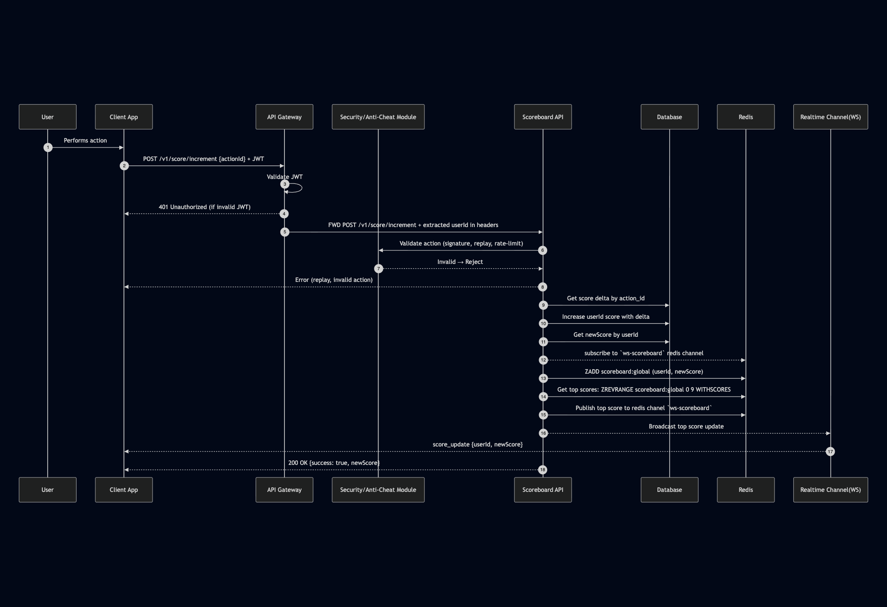

# RFC Scoreboard Module

## Overview
This module provides backend support for a real-time scoreboard system. A user performs an action on the client side, and the server updates their score securely. The scoreboard displays the top 10 users in real time.

## Stories
- As user I can update scores securely When I completes an action.
- As users who is viewing scoreboard I can see new top scores if there are scores is updated real-time.
- Prevent unauthorized score manipulation.
    ### Features breakdown
    1. Secure Score Update API
        - Endpoint for clients to submit score-increment requests.
        - Server must validate that the request is legitimate.
        - Score increments should not be directly supplied by the client.
        - Use server-side computation or verification tokens.
    2. Scoreboard Retrieval API
        - Fetch the top 10 highest scoring users.
        - Responses must be cached or throttled to reduce load.
    3. Real-Time Scoreboard Updates
        - Server sends score changes to connected clients via WebSocket or Server-Sent Events (SSE).
        - Clients listen and update the displayed scoreboard.

## Assumption:
- An authentication/authorization system use a JWT token and it was implemented in current system
- A Security/Anti-Cheat Module is existed that can prevent relay attach, rate-limit, client signature validation,...eg
- Scoreboard screen is show user's name, user's score for an action. (it's better if we have UI design)
- Metric/Obversabilities is out of scope

## High level design system
### Entities:
This just minimum infomation for entities.
    - User: id, name, score
    - Action: id, name, score
### Conponents:
    - Client App
    - API Gateway: a endpoint to access BE service. for monolithic it's included in BE codebase. it response for validate for authentication/authorization
    - Security/Anti-Cheat Module: help to check rate-limite, relay,
    - Scoreboard API
    - Database
    - Redis
    - Realtime Channel(WS): in this case it host in Scoreboard API codebase
### API
Sequence Diagram:
[](./sq-diagram.png)

1. Endpoint for clients to submit score-increment.
    ```
    POST /v1/score/incr/:action_id
    HEADER: Authorazation JWT <Token>
    ```

2. Scoreboard Retrieval API
    ```
    GET /v1/scoreboard/top10
    ```
3. Scoreboard live update channel by using websocket and socket.io library to support namespace, event feature built-in
    ```
    Endpoint: /ws/scoreboard
    Event: liveboard
    Payload: [
        { userId: 1, userName: 'demo 1', Score: 10 },
        { userId:2, userName: 'demo 2', Score: 9 }
    ]
    ```
    Noted: order is sorted by API. so client must be respect BE data

### Storage
1. Using existing database type.
    - Add new column `score` to `users` table
    - Add new table `actions` to config score per action that need to increase once the action has been taken. new `actions` table schema:

        | Column | Type   |
        |--------|--------|
        | id     | int    |
        | name   | string |
        | score  | int    |

2. Add redis is there no existed in current system to accelerate get top n scores
    - Store score by using ZSET feature. that allow us to store score by user id in order so when get top n score very fast
    - Store user metata data like user's id, user's name also to show for score board.
    - Redis also helps to scale websocket broadcast by using pubsub pattern


## Implemetations
### Init websocket
For websocket we can use `socket.io` lib. we can init a websocker server if it wasn't initialize in current system. we init websocket with infomation:
```
Endpoint: /ws
Namespace: scoreboard
Event: liveboard
```

Payload send to this event is:
```
class ScoreBoardItem {
    userId: int;
    userName: string;
    score: int;
}

class TopScoreBoard {
    top: ScoreBoardItem[];
    latestUpdate: Date;
}
```

### Init a redis Pubsub: help to scale websocket (alternative we can use any message queue: kafka, rabbitmq also) but in this context i want to use redis for simple
Using `node-redis` lib for build pubsub pattern. init pubsub info:
Init a publisher:
```
chanel: `ws-scoreboard`

publish payload: TopScoreBoard
```

Init a subscriber: that subscribe to chanel `ws-scoreboard` and the function is send message payload to all websocket connected clients;

### API /v1/score/incr/:action_id
**Solution #1**: Directly update - selected for simple
- When a user completes a action client app invoke this api to increase their score
- Call to ecurity/Anti-Cheat Module to check rate-limit by user_id. If we need to implements a rate-limiter function we can use redis for example
- Implements a function to increase score:
    + Implemements get score by action_id to know earned score from the action. this function could use a cache-manager lib to cache a result(using read through strategy) with a long expiry(could upto 1 day)
    + Increase score by user_id to database. user_id is extracted from header that is forwarded from API-Gateway
    + Update score by user to redis `ZINCRBY scoreboard:global <total_score> <user_id>`

- Implements a function to get top N scores from redis by using redis `ZREVRANGE scoreboard:global 0 N-1 WITHSCORES`
- Implements a function to publish top N scores to redis `ws-scoreboard` to broadcast to

**Solution #2**: Inbox pattern with task queue/job queue - like bullMQ for relisibility
- When a user completes a action client app invoke this api to increase their score
- Call to ecurity/Anti-Cheat Module to check rate-limit by user_id. If we need to implements a rate-limiter function we can use redis for example
- Define a task queue called `incr_score` and handler that will do:
        + Implemements get score by action_id to know earned score from the action. this function could use a cache-manager lib to cache a result(using read through strategy) with a long expiry(could upto 1 day)
        + Increase score by user_id to database. user_id is extracted from header that is forwarded from API-Gateway
        + Update score by user to redis `ZINCRBY scoreboard:global <total_score> <user_id>`
        + call internal api to broadcase
- Expose api POST `/v1/score/broadcast` with api key to broadcast top 1 for internal. the api do:
    + Implements a function to get top N scores from redis by using redis `ZREVRANGE scoreboard:global 0 N-1 WITHSCORES`
    + Implements a function to publish top N scores to redis `ws-scoreboard` to broadcast to


       
